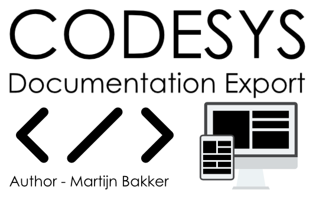

     </img>
    <h2> Parse CODESYS project into a Spinx Source structure. </h2>

  

    This work is licensed under a <a rel="license" href="http://creativecommons.org/licenses/by-nc/4.0/">Creative Commons Attribution-NonCommercial 4.0 International License</a>. 

# Info
The current branch is worked on, and is unstable. 